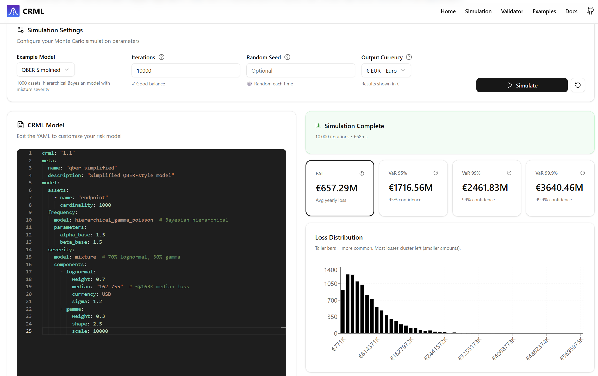
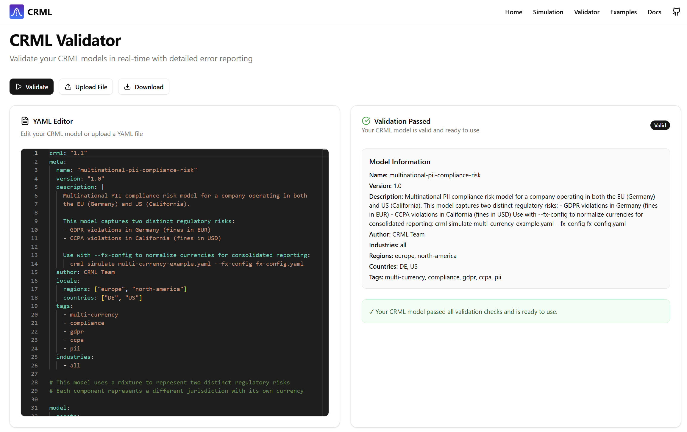

# CRML — Cyber Risk Modeling Language

[](https://pypi.org/project/crml-lang/)
[](https://pypi.org/project/crml-engine/)
[](https://www.python.org/downloads/)
[](https://opensource.org/licenses/MIT)

> **Upstream / Original repository (main development):** https://github.com/Faux16/crml

> **Status:** Draft. This project is under heavy development and may change without notice.
> We welcome input, issues, and contributions.


**Maintained by:** Zeron Research Labs and CyberSec Consulting LLC

**Supported by:**

- Community contributors and early adopters

CRML is an open, declarative, **engine-agnostic** and **Control / Attack framework–agnostic** Cyber Risk Modeling Language.
It provides a YAML/JSON format for describing cyber risk models, telemetry mappings, simulation pipelines, dependencies, and output requirements — without forcing you into a specific quantification method, simulation engine, or security-control / threat catalog.

CRML enables **RaC (Risk as Code)**: risk and compliance assumptions become versioned, reviewable artifacts that can be validated and executed consistently across teams and tools.

## Problem statement (what CRML is solving)

Cyber security, compliance, and risk management professionals often face the same practical problems:

- Risk models are locked in spreadsheets, slide decks, or proprietary tools, making them hard to review, audit, reproduce, and automate.
- Control effectiveness and “defense in depth” assumptions are documented inconsistently, so results vary by analyst and by quarter.
- Threat and control frameworks (e.g., ATT&CK, CIS, NIST, ISO, SCF, internal catalogs) change over time; mappings are brittle and rarely versioned.
- Quantification engines differ (FAIR-style Monte Carlo, Bayesian/QBER, actuarial models, internal platforms), causing costly rewrites and re-interpretation.
- Audit-ready evidence is fragmented: “what was modeled, with which parameters, using which data, and producing which outputs” is hard to prove.

CRML addresses this by standardizing the *description* of cyber risk models and their inputs/outputs, so different engines and organizations can exchange and execute the same model with clear validation and traceability.

## Why qualitative assessments aren’t enough

Qualitative methods (red/amber/green, “high/medium/low”, maturity scores) are useful for communication and prioritization, but they tend to break down when you need to:

- Justify security spend (or a new security product) by comparing expected risk *with* vs. *without* the investment
- Compare risk consistently across business units, vendors, or time periods
- Show measured risk reduction from controls (not just “improved posture”)
- Connect cyber risk to enterprise risk, insurance, and financial planning
- Produce repeatable, audit-ready evidence of “how we calculated this number”

The next evolution is **quantified risk management**: treating cyber risk as an estimable distribution of outcomes, grounded in explicit assumptions and data, and computed by repeatable methods.
But quantified approaches only scale when models are **standardized** — so they can be validated, reviewed, reused, and executed across tools and teams.

CRML’s goal is to be this standard: it makes the model *portable*, the assumptions *explicit*, and the results *reproducible*.

## Key features

- Control effectiveness modeling — quantify how controls reduce risk (including defense-in-depth)
- Median-based parameterization — specify medians directly for lognormal distributions
- Multi-currency support — model across currencies with automatic conversion
- Auto-calibration — calibrate distributions from loss data
- Strict validation — JSON Schema validation catches errors before simulation
- Implementation-agnostic — works with any compliant simulation engine
- Human-readable YAML — easy to read, review, and audit

## Vision (a world where CRML is the standard)

Imagine a near-future where CRML is as normal to risk work as IaC is to infrastructure:

- A security architect proposes a new control program by updating CRML documents; the change is peer-reviewed in Git with clear diffs.
- GRC and audit teams can trace every metric back to a validated, versioned model (inputs, assumptions, mappings, outputs).
- Different quant engines (vendor platforms, internal FAIR Monte Carlo, Bayesian QBER, insurance actuarial models) all consume the same CRML documents.
- Framework changes are handled by updating catalogs/mappings (also versioned), rather than rewriting the model logic.
- Organizations can exchange models with partners, insurers, and regulators without sending spreadsheets or screenshots.

In that world, cyber risk becomes reproducible, comparable, and automatable across teams — while still allowing methodological diversity.

### Short example (what “standardized CRML” looks like)

A typical organization might keep CRML alongside detection and infrastructure code:

- `risk/models/` — scenarios and portfolios in CRML
- `risk/catalogs/` — versioned control + attack catalogs (internal or external)
- `risk/mappings/` — telemetry/control/threat mappings with ownership and change history
- CI runs `crml validate` on every PR; a nightly job runs `crml simulate` and publishes dashboards

Example snippet (illustrative):

```yaml
crml_scenario: "1.0"
scenario:
  title: "Ransomware — enterprise baseline"
  scope:
    org_unit: "Corporate IT"
    currency: "EUR"

  catalogs:
    controls: "examples/control_catalogs/control-catalog.yaml"
    attacks: "examples/attack_catalogs/attck-catalog.yaml"

  assumptions:
    loss_distribution:
      kind: lognormal
      median: 250000
      sigma: 1.2

  controls:
    - control_id: "CISv8-10.4"
      effectiveness: 0.35
    - control_id: "CISv8-10.5"
      effectiveness: 0.20

  outputs:
    require:
      - metric: eal
      - metric: var
        percentile: 0.95
```

This repository ships two Python packages and a web UI:

- `crml-lang`: language/spec models + schema validation + YAML IO
- `crml-engine`: reference runtime + `crml` CLI (depends on `crml-lang`)
- `web/`: **CRML Studio** — browser UI for validation and simulation (Next.js)

## Installation

If you want the CLI:

```bash
pip install crml-engine
```

If you only want the language library:

```bash
pip install crml-lang
```

## Quick start (CLI)

```bash
crml validate examples/scenarios/qber-enterprise.yaml
crml simulate examples/scenarios/data-breach-simple.yaml --runs 10000
```

## Quick start (Python)

Load and validate:

```python
from crml_lang import CRScenario, validate

scenario = CRScenario.load_from_yaml("examples/scenarios/data-breach-simple.yaml")
report = validate("examples/scenarios/data-breach-simple.yaml", source_kind="path")
print(report.ok)
```

Run a simulation:

```python
from crml_engine.runtime import run_simulation

result = run_simulation("examples/scenarios/data-breach-simple.yaml", n_runs=10000)
print(result.metrics.eal)
```

## Repository layout

- `crml_lang/` — language/spec package
- `crml_engine/` — reference engine package
- `web/` — web UI (Next.js)
- `examples/` — example CRML YAML models and FX config
- `wiki/` — documentation source (MkDocs)

## CRML Studio

CRML Studio lives in `web/`.

Run it locally:

```bash
pip install crml-engine
cd web
npm install
npm run dev
```

Open http://localhost:3000

## Screenshots





## Documentation

See the docs under `wiki/`.

Current document types:

- Scenario documents: `crml_scenario: "1.0"` with top-level `scenario:`
- Portfolio documents: `crml_portfolio: "1.0"` with top-level `portfolio:`

## License

MIT License — see [LICENSE](LICENSE).

