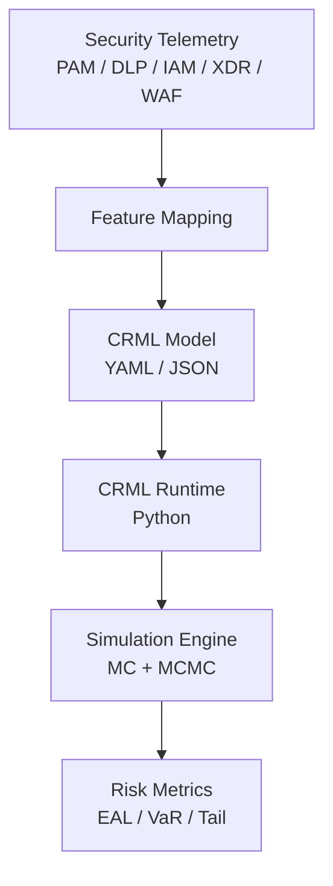

# CRML — Cyber Risk Modeling Language

CRML is a domain-specific language (DSL) and runtime for **quantitative cyber risk modeling**.

It is designed to:

- Capture enterprise cyber risk models as **version-controlled code** (YAML/JSON)
- Support both **FAIR-style Monte Carlo** and **QBER-style Bayesian** models
- Integrate real telemetry from tools like **PAM, DLP, IAM, XDR, WAF**
- Produce defensible metrics such as **EAL, VaR, CVaR, tail quantiles**
- Enable **multi-currency support** with explicit currency declarations and FX normalization

---

## What's New in CRML 1.1

### Human-Readable Median Parameterization
Instead of using obscure log-space parameters, CRML now supports intuitive median values:

```yaml
severity:
  model: lognormal
  parameters:
    median: "100 000"  # $100K - directly from industry reports!
    currency: USD
    sigma: 1.2
```

### Explicit Currency Support
All monetary parameters can now declare their currency explicitly, with FX configuration provided separately:

```yaml
# In your CRML model:
severity:
  model: lognormal
  parameters:
    median: "100 000"
    currency: EUR  # Just specify the currency code
    sigma: 1.2
```

```bash
# Use --fx-config for currency conversion:
crml simulate model.yaml --fx-config fx-config.yaml
```

---

## High-Level Architecture



CRML separates **what** the risk model is from **how** it is executed:

- The **CRML file** declares assets, frequency/severity models, dependencies, and outputs.
- The **runtime** turns this into simulations, posterior estimates, and metrics.

---

## Key Concepts

- **Frequency models**: Poisson, Gamma–Poisson (Negative Binomial), hierarchical
- **Severity models**: Lognormal (with median or mu), Gamma, finite mixtures
- **Currency handling**: Explicit currency declarations with FX normalization
- **Entropy-based criticality**: Shannon entropy over controls, exposure, data classes
- **Dependencies**: Gaussian copula over components
- **Inference**: Metropolis–Hastings MCMC for selected parameters
- **Metrics**: EAL, VaR<sub>95</sub>, VaR<sub>99</sub>, VaR<sub>99.9</sub>

Use the navigation on the left to dive into the **specification**, **runtime**, **examples**, and **API**.
