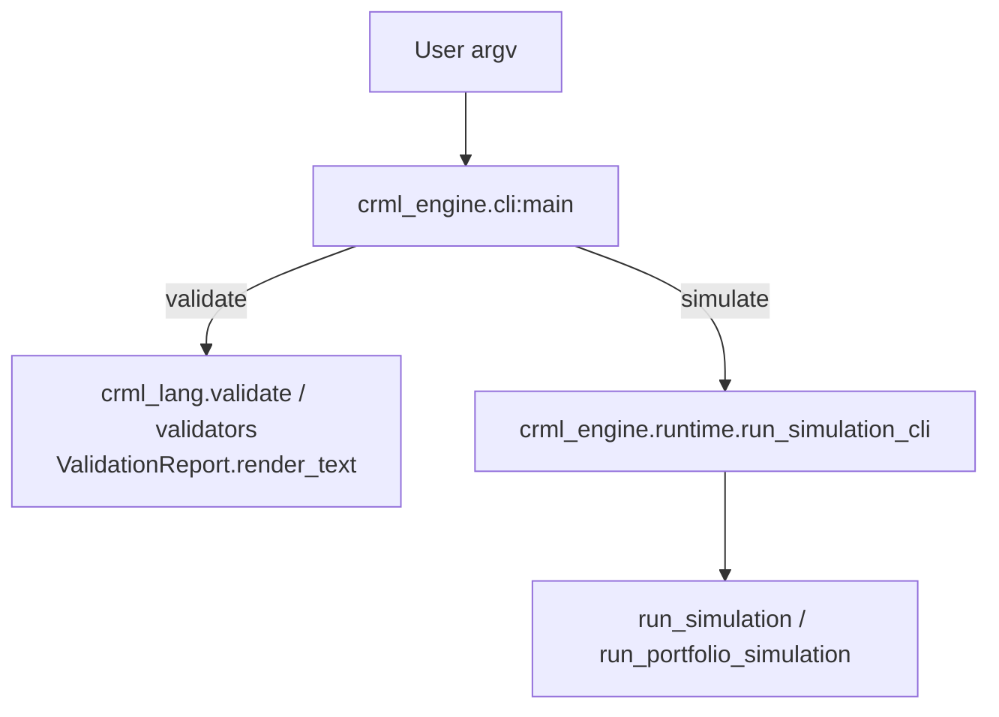
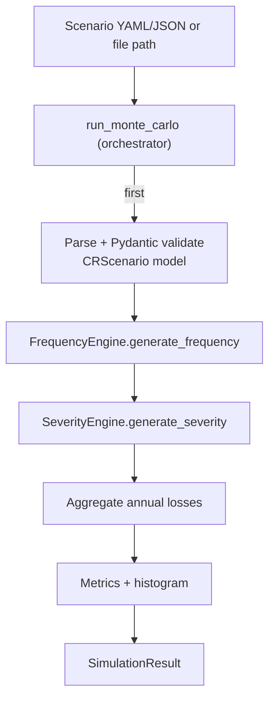
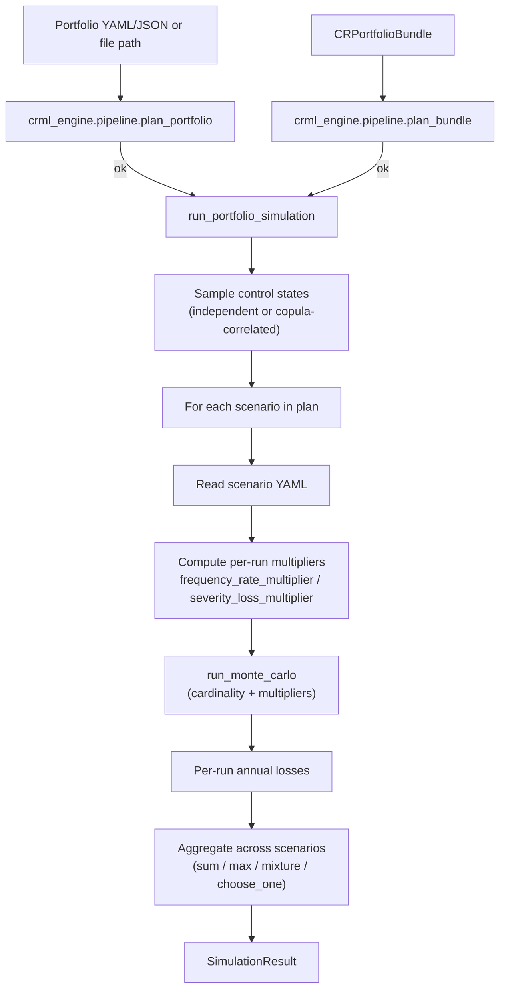

# CRML Engine Architecture (crml_engine)

`crml_engine` implements the CRML **reference runtime**:

- `crml` CLI (validation + simulation)
- scenario Monte Carlo execution
- portfolio execution (planning + multi-scenario aggregation)
- result models and an engine-agnostic result envelope

It depends on `crml_lang` for parsing, schemas, and validation.

Deterministic planning lives in `crml_engine.pipeline`.

Bundling (inlining referenced documents into `CRPortfolioBundle`) lives in `crml_lang`.

## Package layout

- `crml_engine/src/crml_engine/cli.py`: `crml` command (thin wrapper)
- `crml_engine/src/crml_engine/runtime.py`: high-level runtime entrypoints
- `crml_engine/src/crml_engine/simulation/`: Monte Carlo core
  - `engine.py`: orchestration (`run_monte_carlo`)
  - `frequency.py`: frequency engines
  - `severity.py`: severity engines
- `crml_engine/src/crml_engine/models/`: result models + FX model
- `crml_engine/src/crml_engine/copula.py`: Gaussian copula utility used for correlated control states

## CLI architecture

The CLI is intentionally thin and delegates work to the language validator and the runtime.

## Runtime entrypoints

### Scenario execution

Scenario execution uses a single scenario document and runs Monte Carlo.

Notes:

- Parsing and Pydantic validation happen at the start of `run_monte_carlo` (before any simulation work).
- Full CRML schema + semantic validation is provided by `crml validate` / `crml_lang.validate`.
- Scenario documents are scenario-only; exposure scaling is supplied via the runtime as `cardinality`.
- Currency conversion is applied through the FX config.

### Portfolio execution

Portfolio execution consumes a portfolio document (or an inlined bundle), resolves it into a plan (via `crml_engine.pipeline`), runs each referenced scenario, and aggregates under portfolio semantics.

## SCF CMM maturity handling

When a control is assessed using SCF Capability Maturity Model (CMM) levels (`scf_cmm_level: 0..5`), the reference engine:

- Treats maturity as an **ordinal** scale (not a percentage).
- Does **not** assume risk (or control effectiveness) improves linearly with the maturity level.
- Applies a **non-linear mapping** from CMM level to an effectiveness factor in [0, 1], then uses that effectiveness in the runtime multipliers.

Important:

- Any engine that supports `scf_cmm_level` MUST implement a sensible non-linear mapping; it is part of the engine’s specification/behavior.
- The specific mapping is engine-defined; the reference engine’s mapping is implemented in `crml_engine.pipeline.portfolio_planner._scf_cmm_level_to_effectiveness`.

## Result formats

The engine supports two result layers:

- `SimulationResult`: runtime-friendly result model used by CLI text output.
- `CRSimulationResult`: engine-agnostic contract designed for tools/UIs.

`run_simulation_envelope(...)` converts the runtime result into a stable envelope format.

## Web integration (CRML Studio)

The web UI in `web/` integrates by calling:

- validation: executes `crml validate` and parses its output
- simulation: runs Python and calls `crml_engine.runtime.run_simulation_envelope`

This ensures the UI uses the same validator/runtime behavior as the CLI.
