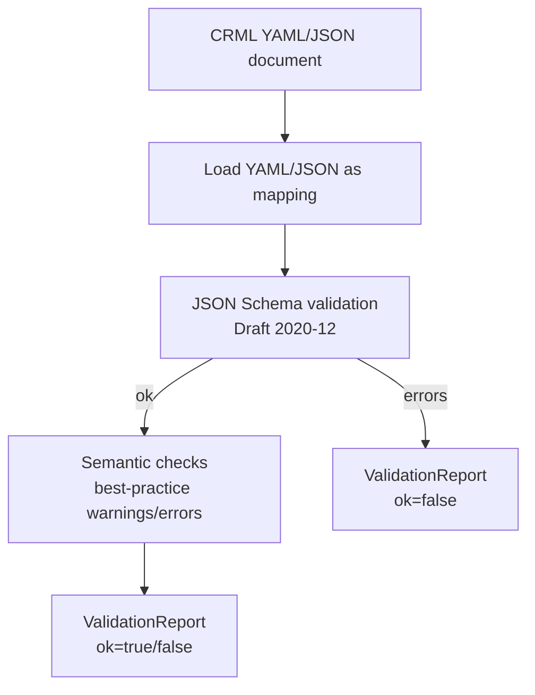

# CRML Language Architecture (crml_lang)

`crml_lang` implements the CRML **language/spec layer**:

- document models (Pydantic)
- bundled JSON Schemas
- structured validation (schema + semantic checks)
- YAML load/dump helpers

It also defines engine-agnostic contract models that engines/pipelines can produce (e.g. `CRPortfolioBundle`).

It intentionally does **not** run simulations.

## Package layout

- `crml_lang/src/crml_lang/api.py`: public, stable convenience API (recommended imports)
- `crml_lang/src/crml_lang/models/`: typed document models
- `crml_lang/src/crml_lang/schemas/`: JSON Schemas shipped as package data
- `crml_lang/src/crml_lang/validators/`: document-type validators returning `ValidationReport`

## Inputs and outputs

### Inputs

- Scenario document (`crml_scenario: "1.0"`)
- Portfolio document (`crml_portfolio: "1.0"`)
- Control cataloge
- Attack cataloge
- Assessment cataloge
- Control relationships pack (`crml_control_relationships: "1.0"`)

### Outputs

- `ValidationReport`: structured validation (errors + warnings) with optional text rendering
- `SimulationResultEnvelope`: standardized, engine-agnostic output contract for risk engines and visualization tools

## Bundle contract

`crml_lang` defines `CRPortfolioBundle` as an engine-agnostic, self-contained artifact that inlines a portfolio's referenced scenarios (and optionally control cataloges, assessments, and control relationships packs).

This bundle is *inlined-only*: it does not contain planning-derived fields (e.g., per-scenario cardinality or resolved control effects).

Producing bundles is a language/tooling concern implemented in `crml_lang`.

Building an execution plan from a bundle is a deterministic engine pipeline concern implemented in `crml_engine.pipeline`.

## Validation architecture

Validation is schema-first and structured.

Notes:

- Validators are split by document type under `crml_lang.validators`.
- The CLI uses `ValidationReport.render_text(...)` to display results, but tools can consume the structured messages directly.

## Public API

Recommended entrypoints:

- `from crml_lang import validate` (scenario validation)
- `from crml_lang import validate_portfolio` (portfolio validation)
- `from crml_lang import bundle_portfolio` (create a self-contained `CRPortfolioBundle`)
- `from crml_lang import CRScenario, CRPortfolio, CRPortfolioBundle` (typed document/contract models)
