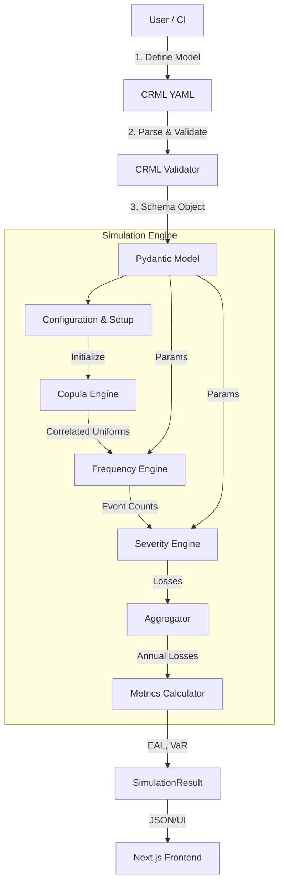

# CRML System Architecture

## Overview
The CRML (Cyber Risk Modeling Language) Simulation Engine is a modular, high-performance Monte Carlo system designed to quantify cyber risk. It decouples the risk model definition (YAML/JSON schema) from the probabilistic execution engine.

## High-Level Architecture

## Core Components

### 1. Data Model (`src/crml/models`)
- Defines the `CRMLSchema` using Pydantic.
- Enforces strict typing for Assets, Frequency, Severity, and Correlations.
- Components: `crml_model.py`, `fx_model.py`, `result_model.py`.

### 2. Simulation Engine (`src/crml/simulation`)
The engine orchestrates the Monte Carlo process.

- **Engine (`engine.py`)**: The main entry point `run_monte_carlo`. Handles:
    - Parsing and Validation.
    - **Asset Correlation**: Computes the Gaussian Copula (Cholesky decomposition) to generate correlated random numbers for dependent assets.
    - **Scenario Loop**: Iterates through each risk scenario (Asset + Frequency + Severity).
    
- **Frequency Engine (`frequency.py`)**:
    - Generates event counts per year.
    - Supports `Poisson`, `Gamma`, and `Hierarchical Gamma-Poisson`.
    - Accepts correlated uniforms to induce dependencies.

- **Severity Engine (`severity.py`)**:
    - Generates loss magnitudes for each event.
    - Supports `Lognormal`, `Gamma`, `Pareto`, and `Mixture` models.
    - Handles currency conversion at the event or aggregate level.
    
### 3. Frontend (`web/`)
- **Next.js** application for interactive validation.
- **WASM / API**: Runs the Python engine (via API currently) to provide real-time feedback.
- **Visualizations**: Displays Risk Cards, Loss Distributions, and Correlation status.
