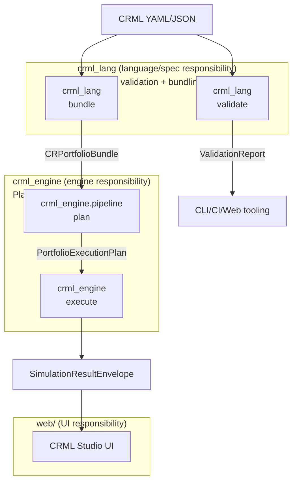
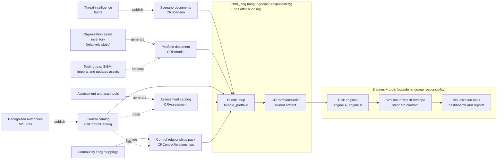

# CRML System Architecture

CRML is organized into three layers:

- **Language/spec (`crml_lang`)**: schemas, models, validation, YAML IO
- **Runtime/engine (`crml_engine`)**: CLI + simulation runtime + portfolio execution + result serialization
- **Web UI (`web/`)**: CRML Studio (Next.js UI + API routes that call the CLI/runtime)

For the detailed architecture, see:

- [Architecture-Language](Architecture-Language)
- [Architecture-Engine](Architecture-Engine)

## Document types

- Scenario documents: `crml_scenario: "1.0"` (top-level `scenario:`)
- Portfolio documents: `crml_portfolio: "1.0"` (top-level `portfolio:`; if `portfolio.assessments` is used, `portfolio.control_catalogs` must also be provided)
- Control cataloges documents: `crml_control_catalog: "1.0"` (top-level `catalog:`)
- Assessment documents: `crml_assessment: "1.0"` (top-level `assessment:`)
- Control relationships documents: `crml_control_relationships: "1.0"` (top-level `relationships:`; control-to-control mappings with overlap metadata)
- FX config documents: `crml_fx_config: "1.0"` (top-level `base_currency`, `output_currency`, `rates`, optional `as_of`; engine-owned config document)
- Portfolio bundle artifacts: `crml_portfolio_bundle: "1.0"` (top-level `portfolio_bundle:`)
- Simulation result artifacts: `crml_simulation_result: "1.0"` (top-level `result:`)

## System-level data flow

## Ecosystem data flow

CRML is designed so that organizations can assemble *auditable, portable* input artifacts from common upstream sources, and so that any compliant engine can emit results in a shared format that downstream tools can visualize.

In practice:

- **Threat intelligence** produces or informs *scenario documents* (frequency, severity, narratives, assumptions).
- **Portfolios** describe the organization's relatively stable assets, business units, and exposure structure. They can be updated via internal tooling (e.g., CMDB/asset inventory imports), but the portfolio document remains the central reference.
- **Control catalogs** come from recognized authorities and frameworks (e.g., NIS, CIS) or can be commonly defined by the community. These catalogs define the canonical control set and their semantics.
- **Assessments** come from assessment/scan tools and audits. They capture which controls exist, how effective they are, and can optionally be used to populate or update the portfolio's control mapping.
- **Mappings** (control-to-control relationships) can come from public sources (e.g., Secure Controls Framework) and from community or organization-specific mapping work.

The language layer then provides a deterministic bundling step that inlines the referenced material into a self-contained `CRPortfolioBundle`, which can be handed to any risk engine without requiring filesystem access.

Engines are expected to return results using the **language-owned result envelope** (`SimulationResultEnvelope`). This creates a stable interface for any visualization tool (web UI, BI dashboards, reporting pipelines) to consume outputs without being coupled to a specific engine implementation.

