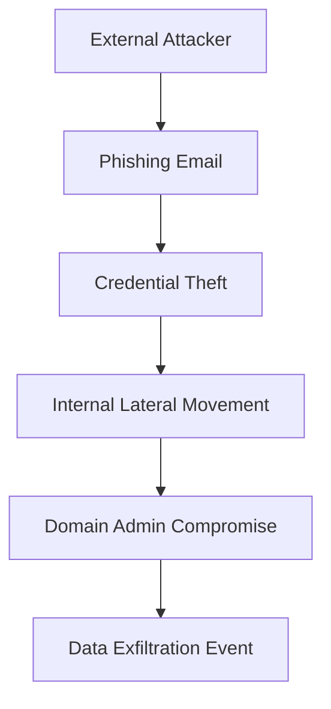

# Attack Graphs & CRML

Attack graphs model how adversaries move through states (assets, privileges,
controls) to realize an impact.

While CRML itself does not *define* a full attack-graph DSL, it is often used
together with attack graphs:

- attack graph → probabilities / rates for edges
- CRML → frequency/severity of resulting loss events

---

## 1. Simple attack graph (Mermaid)

In a more advanced setup:

- The transition frequencies / probabilities from A→F are estimated from
  telemetry and red-team data.
- Resulting **exfiltration events** are modeled in CRML as losses.

---

## 2. Mapping to CRML

Example:

- Node **F: Data Exfiltration Event** → CRML severity model (lognormal mixture)
- Edge rates **B→C, C→D, D→E** → contribute to CRML frequency parameters

CRML does not need the **graph topology**; it needs the **aggregated frequency
and severity characteristics** derived from the graph.

You can store attack-graph definitions in a separate repo, and CRML as the final
risk aggregation layer.
