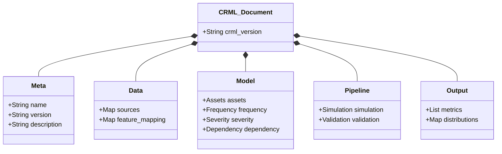
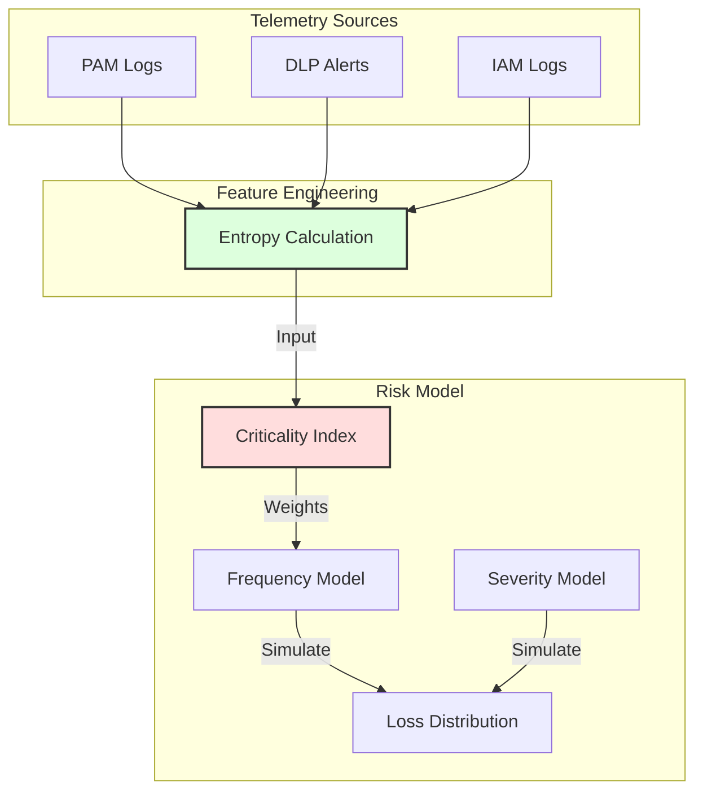

# CRML Diagrams

This page visualizes the structure and workflows within the Cyber Risk Modeling Language (CRML) ecosystem using Mermaid diagrams.

## 1. CRML Execution Workflow

This diagram illustrates how a CRML model file is processed from definition to final reporting.

```mermaid
graph LR
    User[User / Analyst] -->|Writes| CRML[CRML Model (.yaml)]
    CRML -->|Input| Validator[CRML Validator]
    Validator -->|Validates| Spec[CRML Spec 1.1]
    Validator -->|Pass| Engine[Simulation Engine]
    
    subgraph Engine Process
        Engine -->|Parses| ModelObj[Internal Model]
        ModelObj -->|Simulates| MC[Monte Carlo / MCMC]
        MC -->|Generates| Post[Posterior Distributions]
    end
    
    Post -->|Output| Report[Reports & Metrics]
    Post -->|Export| Data[CSV / JSON Data]
    
    style CRML fill:#f9f,stroke:#333,stroke-width:2px
    style Engine fill:#bbf,stroke:#333,stroke-width:2px
```

## 2. CRML Document Structure

The hierarchical structure of a valid CRML document.



## 3. QBER Logic Flow

A visualization of the "QBER" (Quantified Bayesian Event Risk) model logic, showing how telemetry drives risk estimates.

